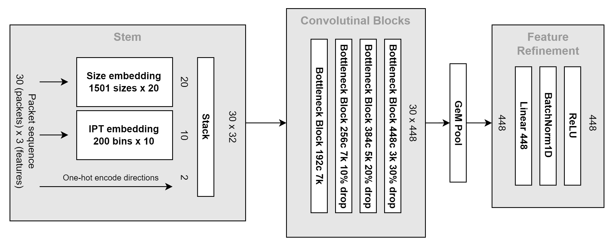

# CESNET Models

This is documentation of the [CESNET Models](https://github.com/CESNET/cesnet-models) project. 

The goal of this project is to provide neural network architectures for traffic classification and their pre-trained weights. The weights were trained using public datasets available in the [CESNET DataZoo](https://github.com/CESNET/cesnet-datazoo) package.

The newest network architecture is called 30pktTCNET. It processes packet sequences in order to create flow embeddings that are useful across traffic classification tasks. See the [getting started][getting-started] page and [models][available-models] reference for more information.

### 30pktTCNET
{ width="800" }

An older network architecture, which apart from packet sequences also utilizes flow statistics, is named Multi-modal CESNET v2 (mm-CESNET-v2).

### Multi-modal CESNET v2
{ width="400" }

### Papers

Models from the following papers are included:

* [Fine-grained TLS services classification with reject option](https://doi.org/10.1016/j.comnet.2022.109467)  
Jan Luxemburk and Tomáš Čejka  
Computer Networks, 2023

* [Encrypted traffic classification: the QUIC case](https://doi.org/10.23919/TMA58422.2023.10199052)  
Jan Luxemburk and Karel Hynek  
2023 7th Network Traffic Measurement and Analysis Conference (TMA)